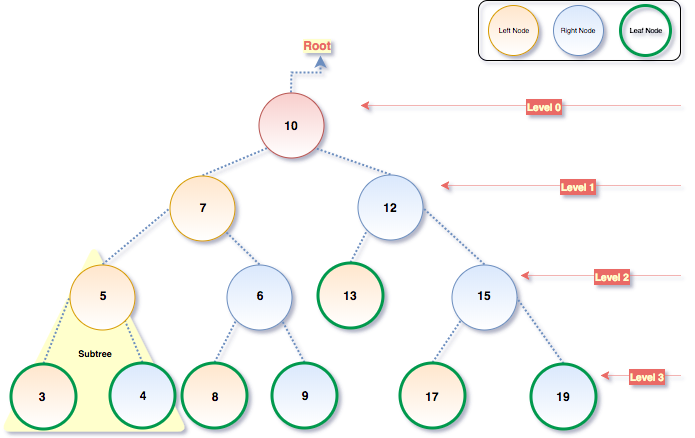

### What is a binary search tree and what is it useful for?
___

<em>Before explaining what a binary search tree is, let me explain what a tree is. A tree is an abstract model of hierarchical structure. A tree consists of nodes with a parent-child relationship. Each node has a parent (except the first node at the top) and zero or more children.</em>

 

<em>The top node in the tree is called a root node (10 in case of the diagram above). It is the node that does not have a parent. There are two kinds of nodes in a tree - <strong>internal node and external node</strong>.</em>

<em>Internal nodes (10, 7, 12, 5, 6, 15 in case of diagram above) are those nodes which have atleast one child. External nodes are nodes which do not have any children. An external node is also refered to as leaf (13, 3, 4, 8, 9, 17, 19 in case of diagram above).</em>

<em>A node can have descendants and ancestors. The ancestors of a node (except the root) are parents, grandparents and great-grandparents and so on. The descendants of a node are children (child), grandchildren (grandchild) or great-grandchildren (great-grandchild) and so on. For example 5 has 7 and 10 as its ancestors and 3 and 4 as its descendants.</em>

<em>Another terminology used with trees is the subtree. A subtree consists of a node and its descendants. For example 5, 3, 4 or 6, 8, 9 or 12, 13, 15 or 15, 17, 19 can all be called subtrees.</em>

<em>Depth of the node consists of the number of ancestors. For example, node 13 has a depth of 2 as it only has two ancestors. Node 3 has depth of 3 as it has a total of three ancestors.</em>

<em>The height of a tree consists of the maximum depth of any node. A tree can also be broken down into levels. The root is on level 0, its children are on level 1, their children on level 2, and so on.</em>

<em>A node in a binary tree has two children at most: one left child and one right child. This defination makes node insertions, searches and deletions more efficient.</em>

<em>A binary search tree is binary tree, but it only allows us to store nodes with lesser value on the left-hand side and nodes with higher value on the right-hand side.</em>

