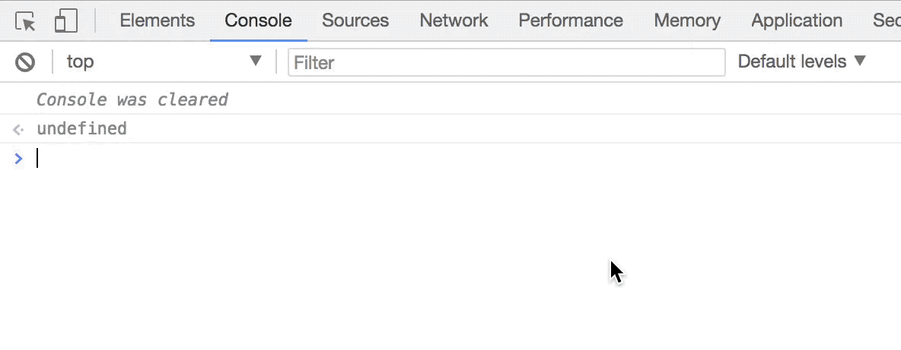
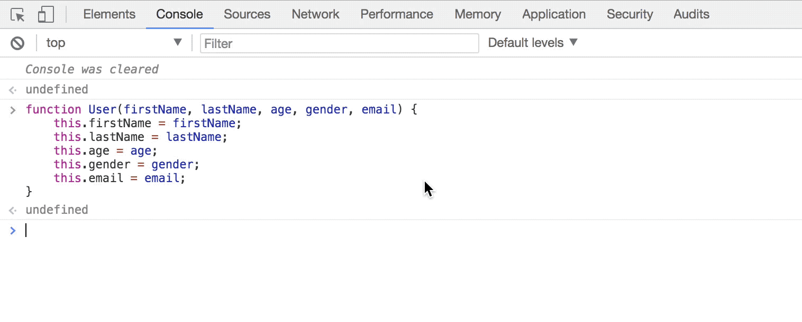

### Notes on Constructor Function

<i>Let me begin by explaining <b>What is a constructor function and what does it do?</b></i>

<i>A constructor function is simply a function that creates an Object class. It allows us to create multiple instances of that class. In other words, What this simply means is that a contructor function allows us to create a lot of object very quickly and these objects will have the same property and the same functionality as they belong to the same class.</i>

<i>Lets simplify this further with the help of an example. Lets suppose there is a social networking site with billions of users. Imagine these users as objects of the same class. So they will all inherit the same properties like First Name, Last Name, Email, Phone number etc. Suppose we had to build a site like that and create a bunch of users, we will start by creating a constructor function like so: </i>



<i>Notice that the function `User` is capitalized. This is a common convention when creating a constructor function. The function contains parameters like firstName, lastName etc. which are going to be the properties of all instances of the User class.</i>

<i>Now lets use this User class to construct some User objects (or instances).</i>

```js
var user1 = new User("Martina", "Novratilova", "30", "female", "martiNova@xyz.com");
```

<i>And just like that a `user1` object was created from the `User` class. Notice the use of the `new` keyword which is required to invoke the User class. If we type `user1` in the browser console we will see what we just created: </i>



<i>Lets create a few more user:</i>

```js
var user10 = new User("Gabbar", "Singh", 35, "male", "kitneAadmiThe@ramgadh.com");
```

```js
var user200 = new User("Alan", "Turing", 25, "male", "alanturing@turingmachine.com");
```

<i>Any number of instances can now be created and they all will inherit the same property of the User class.</i>

<i>Let me now throw some light on the `this` keyword that is used inside of the constructor function to assign its properties. The `this` keyword is the reason why objects can be created from the constructor function. The point to note here is that the `this` keyword does not refer to the User function instead, it refers to the object that will be created by this function. So in a way it is making sure that all the objects that will be created using the User function will all have a first name, last name, age, gender and email as their properties.</i>

