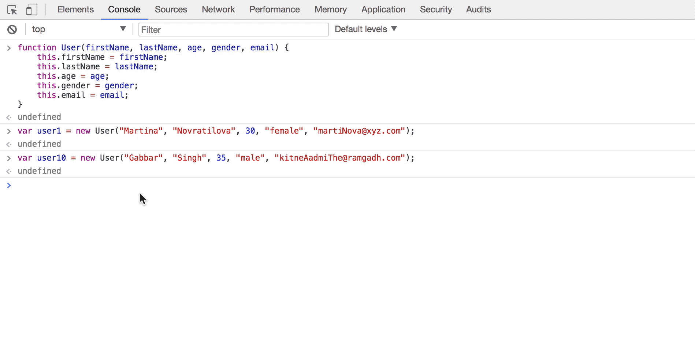

### Notes on Prototype Object

<i>A Prototype Object is simply an object that multiple other objects can refer to. This allows objects to acquire any additional information and functionality that they need. Let me explain this with help of an example.</i>

<i>Earlier I had created a constructor function called User and created a few instances from it. I'll extend that example further by supposing that the social media site for which this constructor function was created wants every user to have @socialMedia.com email domain. I can add this property to the User class by putting it on the prototype of the class like so:</i>

```js
User.prototype.emailDomain = "@socialMedia.com";
```

<i>Notice that if I check the user1 object in the browser this property is not directly on it. However, if I explore the object by clicking the dropdown I will find the property under its `__proto__` object.</i>



<i>One important thing to note here is that the prototype object on which the property was put and `__proto__` object are not the same thing, however, they are very similar. Basically, anything that is put on the constructor function's prototype is accessable from the `__proto__` object. So, if I put a property like emailDomain on the User class's prototype it will be on the `__proto__` of all the instances that I create using this class.</i>

<i>The same thing holds true for any method that I put on the prototype. For example, if I want all the User instances to have a getEmail method, I can just put it on the prototype and it will be accessable.</i>

```js
User.prototype.getEmail = function() {
	console.log(this.firstName + this.lastName + this.emailDomain);
}
```

This method is now accessable to all the instances of the User class. I can confirm that by typing `user10` in the browser console. And if I invoke this method typing `user10.getEmail()` it will print the email address of the user with the socialMedia.com domain name. 


